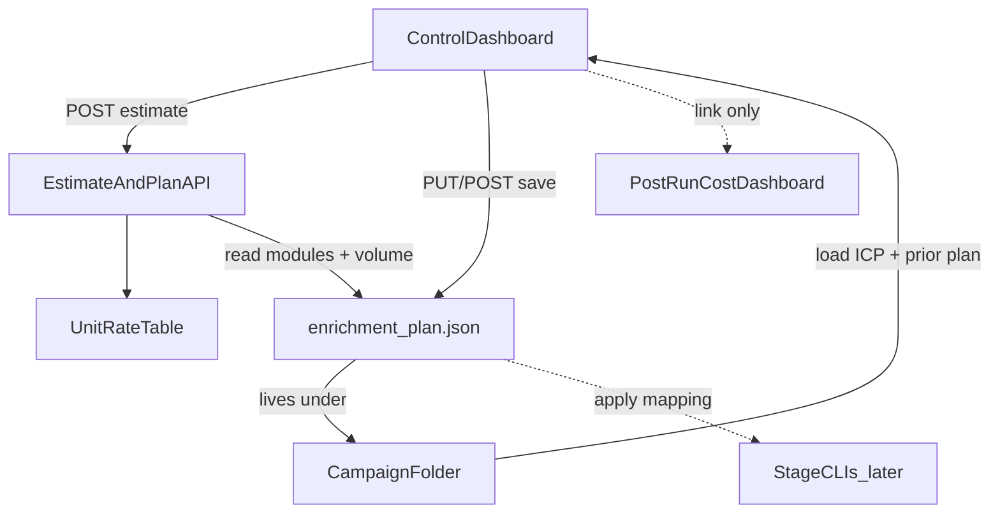

# SPEC — List-building control dashboard

**Status:** Spec + portal UX (2026-09). Live UI:

- **Ledger:** `GET /dashboard` — `agent/dashboard/static/dashboard.html` + `portal.css`; data from `GET /dashboard/api` (hash routes `#/client/…`, `#/campaign/…`).
- **List builder:** `GET /builder?new=1` (create) or `/builder?campaign=…` (edit enrichment); `builder_routes.py`, `enrichment_plan.py`.
- Serve: `python scripts/serve_cost_dashboard.py` (opens `/dashboard` by default).
**Audience:** Operator-first (TBO); structure so clients can use the same controls later.  
**Related:** Post-run spend is the same SPA product — see `agent/dashboard/routes.py`, `scripts/build_cost_dashboard.py`. Locked pipeline decisions: `docs/DECISIONS.md`. Talent pipeline behind the talent board: [`SPEC-talent-search.md`](SPEC-talent-search.md).

---

## 1. Purpose

Give the operator **control over how a list is built before money is spent**, and a **rough per-lead / per-run cost estimate** that updates as they choose modules.

Today operators flip process-wide env flags (`APIFY_SKIP_*`, `APOLLO_SKIP_PHONE`, `WEBSITE_CRAWLER`) and only see spend **after** a run on the cost portal. This dashboard is the **pre-run** counterpart: choose modules → estimate → save a per-campaign plan → (later) run stages against that plan.

### Non-goals

- Visual design, wireframes, CSS, or brand look (design session).
- Replacing or redesigning the existing **post-run** cost ledger (`GET /dashboard` SPA: overview / client / campaign).
- Implementing the `talent_search` stage CLIs / people seed actors (see [`SPEC-talent-search.md`](SPEC-talent-search.md); this dashboard SPEC only defines board + estimate behavior).
- Outreach copy, email send, or client-facing delivery UI.
- Google Sheets / Drive upload from this UI (delivery stays post-run).
- Client accounts / multi-tenant auth (v1 is operator-local; optional shared secret only).

---

## 2. Campaign types (board behavior)

| `campaign_type` | Primary object | Board behavior |
|-----------------|----------------|----------------|
| `company_outreach` | Company → decision-maker | Full module board: essential locked + core (recommended) + optional toggles |
| `talent_search` | Person (candidate) | Slim **fixed** pipeline board; volume drives estimate; modules mostly not freely toggled in v1 |

Stored on the plan (and optionally mirrored on `campaign.json` later). Default for existing campaigns: `company_outreach`.

### Talent search board (display + estimate; pipeline in SPEC-talent-search)

Fixed order shown to the operator (builder talent board):

1. Initial seed scrape (e.g. Apify LinkedIn people/jobs → person URLs)  
2. Personal profile scrape (Apify)  
3. Deduplication (**essential locked**)  
4. ICP match (**essential locked**)  
5. Apollo email reveal  
6. Apollo phone reveal (optional toggle)

Cost estimate for talent uses **seed count × assumed pass rates** through elimination steps (defaults documented in §5). Full stage schemas, orchestrator, and Apollo/Apify wiring: **[`SPEC-talent-search.md`](SPEC-talent-search.md)**.

---

## 3. User flows (textual)

No layouts — only behavior a designer and implementer must support.

### 3.1 Open / select campaign

1. Operator opens the control dashboard (local FastAPI or `serve_cost_dashboard.py` sibling route).
2. Selects an existing `campaign_id` under `data/campaigns/{id}/`, or creates a stub that points at an existing folder.
3. UI loads: display name, `campaign_type`, short ICP summary (titles, geo, size), prior `enrichment_plan.json` if present.

### 3.2 Configure company outreach plan

1. Essential steps (`icp_match`, `dedupe`) are always shown as on / locked.
2. Core modules default on and are marked **Recommended**.
3. Optional modules default off (company profile, company jobs, phone).
4. Operator sets **target contactable leads** (or seed count for estimate).
5. Each toggle updates a live **$/lead** and **estimated run total** with a confidence label (`est`).
6. Operator **saves** → writes `data/campaigns/{id}/enrichment_plan.json`.

### 3.3 Configure talent search plan

1. Board shows the fixed six steps; essential locks on dedupe + ICP.
2. Operator sets expected **seed volume** (and optionally override pass-rate defaults).
3. Estimate updates; save plan with `campaign_type: talent_search`.

### 3.4 After save (later phases — documented for connections)

- Link to post-run cost portal for actuals (`/dashboard`, `/dashboard/campaigns/{id}`).
- Export / apply plan to CLI env (mapping in §6) — not required for design session.
- “Start run” is **out of v1 UI**; plan file is the contract for the runner.

### 3.5 Email toggle gate (`company_outreach`)

If `apollo_email` is turned **off**:

- Delivery mode becomes **LinkedIn-only** (not “contactable” under current `docs/DECISIONS.md` D3).
- UI must show a clear warning: no Apollo personal email → list is not email-deliverable; downstream website/LinkedIn enrich may still run only if the runner defines a LinkedIn-only path.
- **v1 recommendation:** keep `apollo_email` **on by default**; allow off only with explicit confirmation. Do not silently claim “contactable leads.”

---

## 4. Module board — company outreach

| ID | Label | Vendor | Tier | Default |
|----|-------|--------|------|---------|
| `icp_match` | ICP match | Local | Essential locked | Always on |
| `dedupe` | Deduplication | Local + Sheets ContactDedup | Essential locked | Always on |
| `apollo_email` | Email reveal | Apollo | Core (recommended) | On |
| `apify_dm_profile` | LinkedIn decision-maker profile | Apify | Core | On |
| `apify_dm_posts` | LinkedIn decision-maker recent posts | Apify | Core | On |
| `website_scrape` | Website scrape | Apify (default) / Firecrawl | Core | On |
| `apify_company_profile` | LinkedIn company profile | Apify | Optional | Off |
| `apify_company_jobs` | LinkedIn company open jobs | Apify | Optional | Off |
| `apollo_phone` | Decision-maker phone reveal | Apollo (async webhook) | Optional | Off |

### Tier rules

- **Essential locked:** Visible, not toggleable, $0 in estimator (local compute).
- **Core:** Recommended on; operator may turn off with consequence copy where needed.
- **Optional:** Off by default; turning on adds line items to the estimate.

### Website crawler note

Plan may include `website_crawler: "apify" | "firecrawl"` (default `apify`, matching `WEBSITE_CRAWLER`). Affects rate line only; does not change which module is toggled.

---

## 5. Cost estimator

### Inputs

- Selected modules (and website crawler backend).
- `target_leads` (company outreach: intended contactable count) **or** `seed_count` (talent / company seed volume).
- Optional pass-rate overrides for talent (else defaults below).
- Unit rate table (§5.2).

### Outputs

- Per-module line items: `{ module_id, label, unit_usd, units, line_usd, basis }`.
- `usd_per_lead` (typical).
- `usd_run_total` ≈ `usd_per_lead * billable_leads` (see volume rules).
- Optional `usd_per_lead_low` / `usd_per_lead_high` if rates have ranges.
- `confidence`: always `est` for pre-run (never claim Apify API truth until post-run portal).

### Volume rules (company outreach)

| Module | Units billed per lead (rough) |
|--------|-------------------------------|
| `apollo_email` | ~1–2 Apollo credits (people match / reveal); use configurable `apollo_credits_per_lead` default **1.5** |
| `apify_dm_profile` | 1 person-profile actor run |
| `apify_dm_posts` | 1 posts actor run (capped posts via `APIFY_MAX_LINKEDIN_POSTS`) |
| `website_scrape` | `website_pages_per_company` (default **8** from `FIRECRAWL_MAX_PAGES` / outreach cap) × page or crawl-unit rate |
| `apify_company_profile` | 1 company actor run |
| `apify_company_jobs` | 1 jobs actor run (when enabled) |
| `apollo_phone` | ~1 phone reveal credit (async; still count in estimate when on) |
| `icp_match` / `dedupe` | 0 |

Billable leads for enrich modules ≈ `target_leads` (assume estimate is post-Apollo contactable). Apollo line uses same N unless UI exposes a separate “companies into Apollo” multiplier (default **1.0**; document as future knob).

### Volume rules (talent search)

Defaults (overridable on plan):

| Step | Pass-rate default | Notes |
|------|-------------------|-------|
| After profile scrape | 100% of seeds pay profile | Elimination happens after spend on profile in v1 order |
| After dedupe | 90% | |
| After ICP match | 40% | Heavy elimination |
| Email reveal attempts | 100% of ICP survivors | |
| Email success | 70% of attempts | |
| Phone (if on) | 100% of email successes | |

Estimate = seed_count × (profile unit) + survivors_after_icp × (email + optional phone units). Dedupe/ICP = $0.

### 5.2 Unit rate table (source of truth for estimator)

Prefer env / shared rate helper (same numbers as `agent/utils/cost_tracker.py` where they exist):

| Rate key | Env / source | Role |
|----------|--------------|------|
| `apollo_per_credit` | `APOLLO_CREDIT_USD` (default 0.02) | Email + phone credit lines |
| `firecrawl_per_page` | `FIRECRAWL_PAGE_USD` | Only if `website_crawler=firecrawl` |
| `apify_dm_profile_usd` | Config default **~0.25** (from operator notes / CostTracker hints) until calibrated | Person profile |
| `apify_dm_posts_usd` | Config default **~0.05** (calibrate from Apify truth) | Posts |
| `apify_company_profile_usd` | Config default **~0.05** | Company profile |
| `apify_company_jobs_usd` | Config default **~0.10** | Company jobs |
| `apify_website_per_start_usd` | Config default **~0.02–0.05** per start URL / page equiv | When `WEBSITE_CRAWLER=apify` |
| `llm_website_per_lead_usd` | Optional; from `LLM_PER_1K_TOKENS_USD` × assumed tokens | Website LLM when website module on |

Rates marked “calibrate” must be editable in one place (JSON or env) without UI redesign. Label all as **estimates**.

---

## 6. Connections map



### 6.1 Connection catalog

| Connection | Direction | Source of truth | Payload / notes |
|------------|-----------|-----------------|-----------------|
| Campaign load | `data/campaigns/{id}/` → UI | Folder on disk | Read `campaign.json` / `icp.json` / `run_payload.json` + optional `enrichment_plan.json`. Return name, type, ICP summary, plan. |
| Plan save | UI → `enrichment_plan.json` | File under campaign dir | Full `EnrichmentPlan` (§7). Atomic write. |
| Unit rates | Env + rate defaults → estimator | `.env` + code defaults | Never bake secrets into the plan file; only rate keys/numbers used for math. |
| Estimate API | UI ↔ FastAPI | Computed | Body: plan snapshot + volume → `CostEstimateResponse`. |
| Runtime mapping | Plan → stage env / flags | Documented table below | Wired in a later phase; SPEC is the contract. |
| Post-run cost ledger | UI link → existing routes | `data/cost_dashboard_index.json` (+ optional offline HTML) | `GET /dashboard`, hash client/campaign — actuals, not estimates. |
| Sheets / Drive | — | — | Not connected to control UI in v1. |
| Apollo phone webhook | Indirect | `APOLLO_PHONE_WEBHOOK_URL` | Required if `apollo_phone` on at run time; UI can warn if webhook unset. |

### 6.2 Existing code to reuse (do not reinvent)

| Piece | Path |
|-------|------|
| FastAPI mount / serve | `main.py`, `scripts/serve_cost_dashboard.py` |
| Cost portal routes | `agent/dashboard/routes.py` |
| CostTracker rates | `agent/utils/cost_tracker.py` |
| Post-run cost schema | `agent/utils/cost_report.py`, `examples/campaign_cost_dashboard/` |
| Campaign loaders | `agent/utils/campaign_config.py` |
| Skip flags today | `.env.example`, `agent/integrations/apify.py`, `agent/integrations/apollo.py` |
| Website crawler switch | `WEBSITE_CRAWLER` in `agent/integrations/firecrawl.py` |

### 6.3 Proposed HTTP surface (implement later)

Serve alongside the cost portal (same optional `DASHBOARD_SECRET`).

| Method | Path | Role |
|--------|------|------|
| `GET` | `/builder` or `/dashboard/builder` | Control UI HTML (after design) |
| `GET` | `/builder/api/campaigns` | List campaign ids under `data/campaigns/` |
| `GET` | `/builder/api/campaigns/{id}` | Campaign summary + current plan |
| `POST` | `/builder/api/campaigns/{id}/estimate` | Body: plan + volume → estimate |
| `PUT` | `/builder/api/campaigns/{id}/plan` | Persist `enrichment_plan.json` |
| `GET`/`PUT` | `/builder/api/campaigns/{id}/icp` | Read/write `icp.json` (deterministic; **no product LLM**) |
| `GET`/`PUT` | `/builder/api/campaigns/{id}/seed_sources` | Read/write `seed_sources.json` |
| `GET` | `/builder/api/rates` | Effective unit rates (no secrets) |

ICP drafting help is **local** (IDE agent / Cursor chat + `docs/ICP-INTAKE-TEMPLATE.md`), not an in-app LLM API. Website-stage LLM cost may still appear in estimates when website scrape is on — that is enrichment spend, not ICP construction.

Cross-nav: builder ↔ cost ledger (`GET /dashboard`, scoped `/dashboard/campaigns/{id}`) via shared app chrome. Unit rates default to Automata batch2 Apify truth (~$0.005 person profile, ~$0.009 posts); override with `BUILDER_*` env vars.

Admin-only rebuild of the **cost** portal stays `POST /dashboard/rebuild` — unrelated to plan save.

### 6.4 Runtime mapping (plan → current knobs)

Used when wiring the runner; dashboard save does **not** mutate global `.env`.

| Plan module / field | When off / value | Runtime effect (today’s knobs) |
|---------------------|------------------|--------------------------------|
| `apify_dm_profile` | off | `APIFY_SKIP_PERSON_PROFILE=1` |
| `apify_dm_posts` | off | `APIFY_SKIP_LINKEDIN_POSTS=1` |
| `apify_company_jobs` | off | `APIFY_SKIP_LINKEDIN_JOBS=1` (already default) |
| `apify_company_profile` | off | Skip company profile branch in enrich / contacts LinkedIn enrich |
| `website_scrape` | off | Skip website stage / repair crawl |
| `website_crawler` | `apify` \| `firecrawl` | `WEBSITE_CRAWLER` |
| `apollo_phone` | off | `APOLLO_SKIP_PHONE=1` or skip `request_apollo_phone_reveals.py` |
| `apollo_email` | off | LinkedIn-only mode — **requires explicit runner support**; not a simple env today |
| `icp_match` / `dedupe` | always on | Always run `match_campaign_icp` / `stage_dedupe` (and talent equivalents later) |

---

## 7. Data contracts

### 7.1 `EnrichmentPlan` — `data/campaigns/{campaign_id}/enrichment_plan.json`

```json
{
  "schema_version": 1,
  "campaign_id": "automata_us_rnd",
  "campaign_type": "company_outreach",
  "updated_at_utc": "2026-09-06T00:00:00+00:00",
  "target_leads": 50,
  "seed_count": null,
  "website_crawler": "apify",
  "modules": {
    "icp_match": true,
    "dedupe": true,
    "apollo_email": true,
    "apify_dm_profile": true,
    "apify_dm_posts": true,
    "website_scrape": true,
    "apify_company_profile": false,
    "apify_company_jobs": false,
    "apollo_phone": false
  },
  "talent_pass_rates": null,
  "notes": ""
}
```

Rules:

- `modules.icp_match` and `modules.dedupe` must be `true` if present; API rejects false.
- For `talent_search`, ignore company-only modules in the estimator even if present; prefer a talent module set or the fixed step list in UI.
- `talent_pass_rates` optional object: `{ "after_dedupe": 0.9, "after_icp": 0.4, "email_success": 0.7 }`.

### 7.2 `CostEstimateResponse`

```json
{
  "campaign_id": "automata_us_rnd",
  "campaign_type": "company_outreach",
  "confidence": "est",
  "currency": "USD",
  "billable_leads": 50,
  "usd_per_lead": 0.42,
  "usd_per_lead_low": 0.35,
  "usd_per_lead_high": 0.55,
  "usd_run_total": 21.0,
  "line_items": [
    {
      "module_id": "apollo_email",
      "label": "Email reveal",
      "unit_usd": 0.03,
      "units": 50,
      "line_usd": 1.5,
      "basis": "apollo_credits_est"
    }
  ],
  "warnings": []
}
```

`warnings` examples: phone on but webhook URL missing; email off → LinkedIn-only; Firecrawl selected but no API key.

### 7.3 Campaign summary (GET campaign)

Minimal fields for the UI header:

- `campaign_id`, display name (from `campaign.json` or id)
- `campaign_type` (from plan or default)
- ICP: `job_titles`, `location` / `contact_locations`, size min/max, `website_analysis_mode`
- `plan`: current `EnrichmentPlan` or defaults
- `links`: `{ "cost_dashboard": "/dashboard/campaigns/{id}" }`

---

## 8. Hosting and auth (v1)

- Host on the same operator machine as today’s dashboard: `uvicorn` / `main.py` or extend `scripts/serve_cost_dashboard.py`.
- Optional read/write guard: existing `DASHBOARD_SECRET` (query `?key=` or `X-Dashboard-Secret`), same as cost portal.
- No per-client login in v1.
- Plan files live in gitignored `data/campaigns/` (same as other campaign artifacts).

---

## 9. Phasing

| Phase | Work | Session |
|-------|------|---------|
| **0** | This SPEC | Done when file lands |
| **1** | Visual design / mocks from this SPEC | Separate design session |
| **2** | Estimate + plan APIs + thin UI shell | Implementation |
| **3** | Apply plan → stage runner / env overlay | Implementation |
| **4** | Talent board + people pipeline | Separate SPEC / build |
| **5** | Client-ready auth and copy | Later |

---

## 10. Acceptance criteria (for this SPEC)

- A designer can produce mocks without inventing modules, tiers, or flows.
- An implementer can add `/builder` APIs and `enrichment_plan.json` without inventing connections to campaigns, rates, or the cost portal.
- Talent search is specified only as board + estimate behavior, not as a full pipeline build.
- No mockups or CSS in this document.

---

## 11. Open items (do not block design)

1. Calibrate Apify unit defaults against recent `apify_truth_usd` / actor runs.
2. Whether v1 UI allows `apollo_email` off or locks it on with “coming soon” for LinkedIn-only mode.
3. Exact Apify actor for talent **seed** scrape (people search vs jobs-derived profiles) — pipeline SPEC.
4. Optional “companies into Apollo” multiplier on the estimate for company outreach overshoot.
