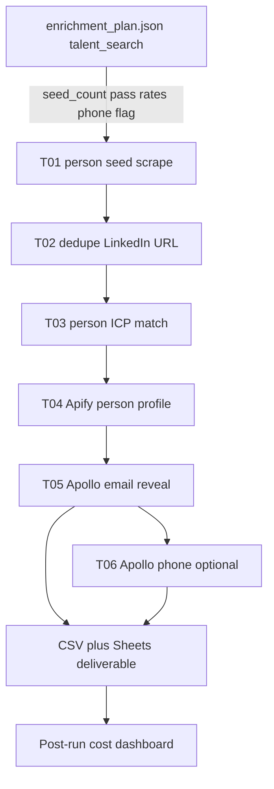

# SPEC — Talent search workflow

**Status:** Spec updated (2026-09-17). Control board + estimate live in `/builder`. **Builder gated list-run works for talent** (Confirm → T01–T05 smoke → Approve → full batch / optional T06). Locked seed actor: **`harvestapi/linkedin-profile-search`**. Locked order: seed → **dedupe → ICP → profile** → Apollo email → phone. Stages T01–T06 + orchestrator tracked in `ROADMAP.md` (Talent Search tasks).  
**Audience:** Operator-first (same as list-building control).  
**Companion docs:**
- Pre-run control UI + estimate: [`SPEC-dashboard.md`](SPEC-dashboard.md)
- Live board UI: `/builder` (`agent/dashboard/static/builder.html`)
- Company-path decisions that still apply to **email deliverability**: [`docs/DECISIONS.md`](docs/DECISIONS.md) D3 (personal email = contactable)
- Executable tasks: [`ROADMAP.md`](ROADMAP.md) § Talent Search

This SPEC defines the **people-first pipeline** behind `campaign_type: talent_search`. The dashboard already shows the six-step board and cost model; this file defines stages, schemas, reuse, and how plan JSON drives a run.

---

## 1. Purpose

Build **lists of people** who are strong matches for a **specific job role** (or tight title cluster), then eliminate weak candidates **before** paying for full personal-profile scrapes, and only then spend Apollo on email (and optional phone).

Primary deliverable: a contactable person row (revealed personal email + LinkedIn) suitable for recruiter / talent outreach handoff — **not** company website intel or DM posts.

### Goals

- New campaign type, not a mode bolted onto company outreach.
- Elimination-first product narrative; fixed step order in v1.
- Reuse Apollo reveal, Apify person profile, Sheets dedup patterns, cost tracking, and the control dashboard plan/estimate contracts.
- Industry- and country-agnostic: role / geo / filters live in `data/campaigns/{id}/` only.

### Non-goals (v1)

- Website scrape, company LinkedIn profile/jobs, DM posts (company-outreach modules).
- LLM qualify / LLM prefilter.
- Client self-serve auth (same as dashboard SPEC).
- Visual redesign (live `/builder` UI is authoritative).
- Replacing LinkedIn people discovery with Apollo people search for **seeding** (Apollo is for reveal after qualification).

---

## 2. Locked product decisions

| Decision | Choice |
|----------|--------|
| Campaign type id | `talent_search` |
| Primary object | Person (candidate), keyed by LinkedIn `/in/` URL |
| Deliverable | Candidate with **Apollo-revealed personal email** (phone optional) |
| v1 step order | Seed scrape → **dedupe → person ICP → personal profile** → Apollo email → Apollo phone |
| Seed actor (default) | `harvestapi/linkedin-profile-search` (override via `seed_sources` / env only if needed) |
| Board toggles | Steps 1–5 fixed; **phone** is the only optional toggle (matches design) |
| Cost UI | Seed count × pass rates; **profile billed on ICP survivors**, not every seed |
| Plan file | Same `enrichment_plan.json` as company outreach (`campaign_type: talent_search`) |
| Designs | Implement UI in `/builder`, not freeform |

### Why dedupe + ICP before profile (v1)

Seed rows already carry lightweight fields from search/CSV (name, headline/title, location, company). Use those for URL dedupe and person ICP so **Apify full-profile spend only hits ICP survivors**. CSV-only seeds with thin fields may ICP-reject more aggressively (missing title/location) — operators should enrich seed CSVs or accept lower pass rates. A later optimization may add a second ICP pass on full profile text without changing this default order.

---

## 3. End-to-end workflow



### What is `enrichment_plan.json`?

Per-campaign file written by **`/builder`** (Save plan). It is **not** the ICP and not the seed list. It stores:

- `campaign_type` (`talent_search` vs `company_outreach`)
- `seed_count` + `talent_pass_rates` (for the **pre-run $ estimate** only)
- `modules` (talent: phone on/off; company modules ignored)
- optional `talent_seed` notes / actor hint

Runtime truth for volume is stage CSVs (how many rows actually seeded/survived). The plan drives the builder estimate and which optional stages the orchestrator runs (phone).

### Step detail

| Step | Id | Vendor | Fail / drop behavior |
|------|-----|--------|----------------------|
| 1. Initial seed scrape | `talent_seed` | Apify `harvestapi/linkedin-profile-search` (or `people_csv_ingest`) | No `/in/` URL → drop from raw seeds |
| 2. Deduplication | `talent_dedupe` | Local + Sheets ContactDedup | Duplicate LinkedIn URL / email → drop; essential locked |
| 3. ICP match | `talent_icp` | Local rules on **seed** fields (title, headline, location, keywords) | Hard exclusions / no title·geo signal → rejected CSV |
| 4. Personal profile scrape | `talent_profile` | Apify `apimaestro/linkedin-profile-detail` (default person actor) | Actor fail → QA flag; do not invent data; **no profile → not Apollo’d** |
| 5. Apollo email reveal | `talent_apollo_email` | Apollo `people/match` | No personal email → not delivered |
| 6. Apollo phone reveal | `talent_apollo_phone` | Apollo + webhook | Optional; skip if plan phone off or webhook missing |

---

## 4. Connection to the control dashboard

Designs already encode the talent board (`Main.dc.html`) and campaign picker (`CampaignSelect.dc.html`). Implementation must keep these contracts.

### 4.1 Plan fields (talent)

Extends [`SPEC-dashboard.md`](SPEC-dashboard.md) §7.1:

```json
{
  "schema_version": 1,
  "campaign_id": "talent_backend_eu",
  "campaign_type": "talent_search",
  "updated_at_utc": "2026-09-07T00:00:00+00:00",
  "target_leads": null,
  "seed_count": 500,
  "website_crawler": null,
  "modules": {
    "icp_match": true,
    "dedupe": true,
    "apollo_email": true,
    "apify_dm_profile": true,
    "apify_dm_posts": false,
    "website_scrape": false,
    "apify_company_profile": false,
    "apify_company_jobs": false,
    "apollo_phone": true
  },
  "talent_pass_rates": {
    "after_dedupe": 0.90,
    "after_icp": 0.40,
    "email_success": 0.70
  },
  "talent_seed": {
    "source_type": "linkedin_people",
    "actor_id": "harvestapi/linkedin-profile-search",
    "query_notes": "Senior Backend Engineer · Spain"
  },
  "notes": ""
}
```

Rules:

- `campaign_type` must be `talent_search`.
- Estimator **ignores** company-only modules even if true.
- `modules.apify_dm_profile` stays conceptually “on” for talent (profile step is fixed); UI does not offer turning it off in v1.
- `modules.apollo_phone` maps to the design’s phone toggle.
- `seed_count` + `talent_pass_rates` drive the estimate (defaults: dedupe 90%, ICP 40%, email success 70% — same as design).

### 4.2 Estimate model (must match product — profile after ICP)

| Cost component | Formula |
|----------------|---------|
| Seed scrape | `seed_count × seed_scrape_usd` |
| Dedupe / ICP | $0 |
| Profile | `survivors_after_icp × profile_usd` |
| Email | `survivors_after_icp × apollo_credits_per_lead × apollo_per_credit` |
| Phone | `email_successes × apollo_per_credit` if phone on else 0 |

Where:

- `after_dedupe = seed_count × after_dedupe_rate`
- `survivors_after_icp = after_dedupe × after_icp_rate`
- `email_successes = survivors_after_icp × email_success_rate`

Placeholder unit rates (calibrate from Apify truth): `seed_scrape_usd ≈ 0.01`, `profile_usd ≈ 0.005–0.25` (actor-dependent), `apollo_per_credit` from `APOLLO_CREDIT_USD`, `apollo_credits_per_lead` default 1.5.

UI warnings (required):

1. Profile spend applies to **ICP survivors**, not every seed.  
2. Pre-run numbers are `est` until post-run cost portal.

### 4.3 Builder API reuse

Same routes as dashboard SPEC (`/builder/api/campaigns/...`). Talent-specific:

- `GET` campaign returns `campaign_type`, `seed_count`, pass rates, phone flag.
- `POST .../estimate` uses talent model when `campaign_type === talent_search`.
- `PUT .../plan` persists the JSON above.
- Cost portal link: `/dashboard/campaigns/{id}` (actuals after runs).

### 4.4 Runtime mapping (talent)

| Plan / UI | Runtime |
|-----------|---------|
| `seed_count` | Informational for estimate; real volume = rows in T01 |
| `talent_seed.source_type` / actor | Seed CLI config in `seed_sources.json`; default actor `harvestapi/linkedin-profile-search` |
| Phone off | Skip T06; `APOLLO_SKIP_PHONE=1` for any shared Apollo helper |
| Phone on | Require `APOLLO_PHONE_WEBHOOK_URL` (+ public base / secret) |
| Profile actor | `APIFY_LINKEDIN_PERSON_ACTOR` (default `apimaestro/linkedin-profile-detail`) |

---

## 5. Campaign folder layout

Under `data/campaigns/{campaign_id}/` (gitignored data; template later under `examples/`):

| Artifact | Role |
|----------|------|
| `campaign.json` | Display name, `campaign_type: talent_search`, segments |
| `icp.json` | **Person** ICP rules (titles, locations, keywords, exclusions, experience signals) |
| `seed_sources.json` | Enabled talent seed source(s) |
| `run_payload.json` | Sender / client handoff context (same shape as company; scoring services optional) |
| `enrichment_plan.json` | Builder plan (§4.1) |
| `stages/` | Talent stage CSVs (§6) |
| `cost_runs.json` | Appended by stage CLIs (reuse cost manifest) |

Do **not** reuse company `01_raw_seeds` company headers as the only schema — use person headers (§6.2). A shared `stages/` directory is fine if filenames are talent-prefixed or a `campaign_type` discriminator selects writers.

---

## 6. Stage artifacts

Recommended filenames (parallel to company `01`–`07`, talent-prefixed to avoid collisions if a folder is mis-typed):

| Stage | File | Contents |
|-------|------|----------|
| T01 | `stages/T01_raw_people.csv` | Seeded person URLs + lightweight seed fields |
| T02 | `stages/T02_deduped.csv` | Unique people after LinkedIn dedupe |
| T02b | `stages/T02_dedupe_rejected.csv` | Dupes dropped |
| T03 | `stages/T03_icp_matched.csv` | Survivors (seed-field ICP) |
| T03b | `stages/T03_icp_rejected.csv` | Elimination reasons |
| T04 | `stages/T04_profiles.csv` | Profile enrichment on ICP survivors |
| T04b | `stages/T04_profile_failed.csv` | Optional QA: actor failures |
| T05 | `stages/T05_apollo_contactable.csv` | Email revealed |
| T05b | `stages/T05_apollo_rejected.csv` | No email / match fail |
| T06 | `stages/T06_phone_enriched.csv` | Optional phone merge |
| Out | Sheet + local CSV via report stage | Delivered contactable list |

### 6.1 Orchestrator

New entry `scripts/run_talent_campaign.py` that:

1. Loads campaign + `enrichment_plan.json` (require `talent_search`).
2. Runs T01→T05 always; T06 if `modules.apollo_phone`.
3. Appends cost manifests; optionally rebuilds cost dashboard.

Company `run_deterministic_campaign.py` must **refuse** talent campaigns with a clear error (already refused).

### 6.2 Person row schema (minimum)

Core identity (T01+):

- `person_id` — stable id (`{campaign_prefix}-{n}` or hash of LinkedIn URL)
- `linkedin_url` — normalized `https://www.linkedin.com/in/...` (no query junk)
- `full_name`, `first_name`, `last_name`
- `headline`, `title`, `location`
- `company_name`, `company_linkedin_url` (optional)
- `source_url`, `seed_source_id`, `notes`

After profile (T04):

- `about`, `experience_summary`, `education_summary` (or structured JSON column)
- `profile_raw_chars`, `profile_scraped_at_utc`
- `profile_status`: `ok` | `failed` | `skipped`

After Apollo (T05):

- `apollo_person_id`
- `email`, `email_status`
- `phone` / `mobile_phone` (T06)
- `apollo_reveal_status`

QA:

- `reject_reason`, `qa_flags`

Normalization: one canonical LinkedIn URL per person (lowercase host, strip trailing slash, strip `?…`).

---

## 7. Stage implementation notes (reuse vs build)

### T01 — Seed scrape

**Reuse (already scaffolded):** `people_csv_ingest` + `linkedin_people` in [`agent/utils/seed_sources.py`](agent/utils/seed_sources.py), helpers in [`agent/utils/talent_people.py`](agent/utils/talent_people.py) + [`agent/utils/linkedin_people_seeds.py`](agent/utils/linkedin_people_seeds.py), CLI [`scripts/stage_talent_seed.py`](scripts/stage_talent_seed.py).

**Default actor:** `harvestapi/linkedin-profile-search` (same HarvestAPI family as company search). Wire input shape (keywords / locations / maxItems) to match the actor; prefer search-card / short mode when available so seed cost stays low — full experience text is the job of **T04**.

**Also support:** `people_csv_ingest` of a person CSV (LinkedIn URL column) — zero Apify seed cost.

**Output:** `T01_raw_people.csv` only rows with parseable `/in/` URLs.

### T02 — Deduplication

**Reuse patterns:** [`agent/utils/deduplication.py`](agent/utils/deduplication.py) ContactDedup (email + LinkedIn).

**Talent keys (in order):**

1. Normalized LinkedIn URL  
2. Apollo person id (if already present)  
3. Revealed email (late; mainly cross-run)

Cross-run: mark delivered LinkedIn URLs / emails on Sheets ContactDedup for the client so re-runs do not re-bill.

### T03 — Person ICP match

**Reuse idea:** deterministic rules like [`agent/utils/icp_match.py`](agent/utils/icp_match.py), **not** company-only fields. Readiness already sketched in [`agent/utils/icp_readiness.py`](agent/utils/icp_readiness.py) for `talent_search`.

**Person ICP (`icp.json` / `person_match`):** titles, contact_locations, keywords, excluded_keywords — applied to **seed** headline/title/location/company (profile text is not available yet).

No LLM in v1. Write reject reasons to `T03_icp_rejected.csv`.

### T04 — Personal profile

**Reuse:** `get_linkedin_person_profile` in [`agent/integrations/apify.py`](agent/integrations/apify.py) (`APIFY_LINKEDIN_PERSON_ACTOR`, default `apimaestro/linkedin-profile-detail`).

**Change:** run **after** ICP, only on matched rows; before Apollo. Default skip-posts (`APIFY_SKIP_LINKEDIN_POSTS=1`).

### T05 — Apollo email reveal

**Reuse:** Apollo `people/match` helpers in [`agent/integrations/apollo.py`](agent/integrations/apollo.py).

**Build:** match by **LinkedIn URL** (and/or name + domain when URL match fails), reveal personal email. Gate: no personal email → `T05_apollo_rejected.csv`.

### T06 — Apollo phone reveal

**Reuse:** [`scripts/request_apollo_phone_reveals.py`](scripts/request_apollo_phone_reveals.py) + webhook import path; Railway webhook service.

Only for T05 contactable rows; skip if plan phone off.

### Report / Sheets

**Reuse:** report stage patterns + Drive folder per client. Person-oriented columns. Handoff JSON may omit company website fields.

---

## 8. ICP and seed_sources examples (illustrative)

`icp.json` (talent-oriented):

```json
{
  "campaign_type": "talent_search",
  "job_titles": ["Senior Backend Engineer", "Staff Backend Engineer", "Backend Engineer"],
  "contact_locations": ["Spain"],
  "keywords": ["Python", "distributed systems", "PostgreSQL"],
  "excluded_keywords": ["recruitment", "staffing", "bootcamp"],
  "person_match": {
    "require_title_signal": true,
    "min_keyword_hits": 1
  }
}
```

`seed_sources.json`:

```json
[
  {
    "id": "linkedin_people_backend_es",
    "type": "linkedin_people",
    "enabled": true,
    "config": {
      "actor": "harvestapi/linkedin-profile-search",
      "max_results": 500,
      "urls": [],
      "query": "Senior Backend Engineer Spain"
    }
  }
]
```

Prefer actor input via HarvestAPI search params (title / location / keywords) once wired in `linkedin_people_seeds.py`; `urls` optional when the actor accepts LinkedIn people-search URLs.
---

## 9. Cost and QA

- Append `cost_runs.json` per stage CLI (same as company funnel).
- Prefer Apify API truth for profile/seed actors in post-run portal.
- QA flags: missing profile, ICP borderline, Apollo match without email, phone webhook timeout.
- Funnel metrics to log: seeds → profiles ok → deduped → ICP pass → email ok → phone ok (mirrors design funnel bars).

---

## 10. Phasing (connect everything)

| Phase | Deliverable |
|-------|-------------|
| **A** | This SPEC + dashboard SPEC aligned |
| **B** | Builder UI (company + talent boards) + plan/estimate APIs |
| **C** | Talent MVP: seed → dedupe → ICP → profile → Apollo email (CSV and/or HarvestAPI seed) |
| **D** | Harden `harvestapi/linkedin-profile-search` input + cost gate after smoke |
| **E** | T06 phone + Sheets delivery + cost portal rows for talent campaigns |
| **F** | Optional: second ICP pass on full profile text (new plan version) |

Executable checklist with parallel groups: **`ROADMAP.md` § Talent Search**.

---

## 11. Acceptance criteria

- Operator can Confirm / Start / Approve a `talent_search` campaign from `/builder` (gated smoke → full batch).
- Operator can save a `talent_search` plan from `/builder` and get estimate math with **profile cost on ICP survivors**.
- A talent run produces person stage CSVs T01–T05 (T06 if phone on) without website crawl or company LinkedIn jobs.
- Contactable output requires Apollo personal email.
- Dedupe + ICP run **before** profile scrape; reject CSVs explain eliminations.
- Company orchestrator does not silently run talent campaigns.
- Default seed actor is `harvestapi/linkedin-profile-search`; no industry/geo hardcoding in Python defaults.
- Reuse existing talent helpers (`talent_people`, `linkedin_people_seeds`, `stage_talent_seed`, Apify person profile, Apollo match, ContactDedup, enrichment_plan / builder).

---

## 12. Open items (smoke before locking modes)

1. HarvestAPI search **mode** for T01 (Short vs Full) — prefer Short/search fields for seed cost; Full is not a substitute for T04 unless measured cheaper.  
2. Apollo `people/match` success rate when only LinkedIn URL is supplied (measure on a 20-person smoke).  
3. Failed profiles: recommend **no Apollo** unless operator force flag (`profile_status=ok` required).  
4. Calibrate `seed_scrape_usd` / `profile_usd` from billed runs.  
5. ContactDedup sheet column conventions for person-first campaigns vs company DM rows.
